# Phân tích luồng nhận diện & 4 pipeline vi phạm

Tài liệu phân tích toàn bộ đường đi của dữ liệu từ lúc frame vào pipeline đến lúc bắn
event + snapshot, cho 4 nghiệp vụ: **PLATE (biển số)**, **NO_HELMET**, **WRONG_LANE**,
**WRONG_WAY**. Kèm đánh giá độ phức tạp và đề xuất cải thiện.

Phạm vi đọc: `src/pipeline/`, `src/probes/`, `src/business/plate/`, `src/communication/`,
`src/utils/`, `resources/ds/`, `resources/config/`.

Môi trường đo thực tế (lúc phân tích): container `vehicle` đang chạy, 6 camera RTSP,
`streammux.batch_size=8`, GPU RTX 3090 (device 1), GPU util ~83%, NVDEC ~20%.

---

## 1. Kiến trúc GStreamer thực tế

`src/pipeline/pipeline.cpp:376-573` dựng chuỗi element theo kiểu "chỉ thêm stage nào có
file model tồn tại". Chuỗi đầy đủ:

```
nvurisrcbin × N ─┐
                 ├─► nvstreammux (batch=8, v2)
                 │
                 ├─► nvinfer  pgie_vehicle      (id=1, 640×640, FP16, interval=0)
                 │     └─ probe: attachBboxProbe    (trên src pad của tracker)
                 ├─► nvtracker (NvDCF_perf, 640×384)
                 │
                 │   ── attachRoiExpandProbe (SINK pad của sgie_plate) ──
                 ├─► nvinfer  sgie_plate        (id=2, YOLO-Pose keypoints, 640×640)
                 ├─► nvdspreprocess preprocess_plate (id=6, warp 4 keypoint → 256×256)
                 ├─► nvinfer  sgie_digit        (id=3, 256×256, input-tensor-meta=1)
                 │     └─ probe: attachRoiRestoreProbe (SRC pad của sgie_digit)
                 ├─► nvinfer  sgie_helmet       (id=4, 640×640, operate-on-class-ids=2)
                 │     └─ probe: attachMetaProbe (SRC pad của stage cuối)
                 │
                 ├─► nvvideoconvert ─► nvdsosd
                 │     └─ probe: attachImageProbe (SRC pad của nvdsosd)
                 └─► fakesink (sync=0, async=0)
```

### 1.1 Năm probe và vai trò

| Probe | Vị trí | Việc làm | Chi phí |
|---|---|---|---|
| `handleBbox` | src pad `tracker` | publish bbox MQTT sớm (chỉ loại xe) | O(objects), nhẹ |
| `handleRoiExpand` | sink pad `sgie_plate` | nới bbox xe +30% & pad đáy 10px, lưu rect gốc vào `misc_obj_info` | O(objects), nhẹ |
| `handleRoiRestore` | src pad `sgie_digit` | trả bbox về gốc, zero-size biển < 20px | O(objects), nhẹ |
| `handleMeta` | src pad stage cuối | **toàn bộ nghiệp vụ**: phân tầng meta, zone test, OCR, 4 loại vi phạm, submit encode | **nặng** |
| `handleImages` | src pad `nvdsosd` | nhận JPEG, ghép snapshot, finalize, emit | **nặng** |

Thiết kế expand/restore rất hợp lý: nới ROI để SGIE1 thấy đủ biển (đặc biệt xe máy biển
nằm sát đáy), rồi restore trước khi SGIE3 helmet chạy — nếu không, helmet sẽ detect trên
vùng đã phình 30%. Điểm khéo là lưu rect gốc **ngay trong `misc_obj_info` của object meta**
thay vì map theo `GstBuffer*`, nên không cần state ngoài và không rò rỉ khi buffer bị drop.

---

## 2. Luồng chung: từ frame đến event

Cả 4 nghiệp vụ dùng **chung một vòng đời track** trong `TrackPlateState`. Không có state
machine riêng cho từng loại vi phạm — mọi vi phạm chỉ là các bộ đếm gắn trên cùng track,
và **tất cả cùng chờ một sự kiện chốt duy nhất: biển số được finalize**.

```
frame ──► PGIE detect xe ──► tracker gán track_id
   │
   ├─ handleBbox:  observeVehicle(in_zone) ──► tạo TrackPlateState  ──► publish bbox
   │
   └─ handleMeta:
        ├─ phân tầng meta 1 lượt:  vehicles[] / plate_of / chars_of / no_helmet_of
        ├─ anchor = điểm đáy bbox (bottom_ratio=0.12)
        ├─ in_zone = pointInPolygon(anchor, PLATE polygons)
        ├─ observeVehicle(track, cls, conf, in_zone)
        │
        ├─ [WRONG_LANE]  nếu in_zone || everEnteredPlateZone
        │      └─ anchor ∈ lane polygon && cls ∉ allowed → observeLane + snapshot
        │
        ├─ [WRONG_WAY]   KHÔNG gate zone (cần anchor mọi frame)
        │      └─ observeWrongWay(anchor, lines) → cắt vạch + đúng hướng → snapshot
        │
        └─ nếu in_zone:
             ├─ [NO_HELMET] cls==motorbike → observeHelmet(số người không mũ)
             └─ [PLATE]     assemblePlateText(chars) → addOcrReading
                              └─ vote → finalizePlate khi đủ N reading
                                 hoặc miss-finalize khi rời zone > 1s

handleImages:
   ├─ nhận JPEG full-frame + crop từ NVDS_CROP_IMAGE_META
   ├─ finalizeMissed / dropStaleWrongWay
   └─ collectReady → pickSnapshotImages → drawGreenRect → enqueue

workerLoop (thread riêng):
   └─ upload S3 → publish MQTT (event thường hoặc 1..3 event vi phạm)
```

### 2.1 Điểm neo chung: `anchorPoint`

Mọi quyết định không gian (in_zone, wrong_lane, wrong_way) đều dùng **một điểm duy nhất**:
tâm ngang đáy bbox, nhích lên 12% chiều cao (`geometry.cpp:9`). Đây là lựa chọn tốt — điểm
tiếp đất của xe ổn định hơn tâm bbox khi xe bị che khuất một phần, và dùng chung một anchor
giúp 3 nghiệp vụ nhất quán về mặt hình học.

### 2.2 Phân tầng metadata — O(n) một lượt

`plate_probe.cpp:836-860` duyệt `obj_meta_list` **đúng một lần**, phân loại theo
`unique_component_id` vào 4 container. Đây là điểm mạnh nhất về hiệu năng của probe: không
có vòng lặp lồng nhau để tìm parent–child. Với `plate_of` còn chọn luôn biển conf cao nhất
mỗi xe ngay trong lượt duyệt đó.

Độ phức tạp: **O(n log n)** với n = số object trên frame (log n từ `std::map` theo con trỏ).
Có thể hạ xuống O(n) bằng `unordered_map`, nhưng n thường < 100 nên không đáng.

---

## 3. Pipeline 1 — Nhận diện biển số (PLATE)

Đây là pipeline phức tạp nhất, 3 tầng model nối tiếp.

### 3.1 Chuỗi model

```
PGIE vehicle (4 class: car/motorbike/truck/bus)
   └─► SGIE1 plate_pose  — YOLO-Pose, network-type=3, output-instance-mask=1
          xuất 4 keypoint góc biển (không chỉ bbox)
          └─► nvdspreprocess warp — homography 4 điểm → tensor 256×256 phẳng
                 └─► SGIE2 digit — 36 class, input-tensor-meta=1
                        └─► assemblePlateText — ghép ký tự thành chuỗi
```

Việc dùng **YOLO-Pose lấy 4 góc + warp perspective** thay vì crop AABB là quyết định đúng
về chất lượng: biển chụp xiên được nắn phẳng trước khi OCR, tỉ lệ đọc đúng cao hơn hẳn
crop thô. `config_preprocess_warp_plate.txt` đặt `network-input-shape=16;3;256;256` khớp
`batch-size=16` của SGIE2.

### 3.2 Ghép ký tự — `char_assembler.cpp`

Thuật toán 3 bước, xử lý được cả biển 1 dòng và 2 dòng:

1. **Dedup theo IoU**: sort giảm dần theo confidence, giữ box không chồng > 0.40 với box
   đã giữ. O(k²) với k = số ký tự (≤ 10) — chấp nhận được.
2. **Fit đường xu hướng** (least squares qua tâm các ký tự) rồi đo **residual spread**.
   Đây là chi tiết tinh tế: biển 1 dòng chụp xiên vẫn bám sát một đường thẳng, nên đo độ
   trải *sau khi khử nghiêng* mới phân biệt được với biển 2 dòng thật.
3. Nếu `spread / avg_h > 0.50` → tách 2 dòng tại trung điểm residual, sort mỗi dòng theo x.

### 3.3 Vote và chốt biển

`track.cpp:106-155`. Mỗi reading được tích lũy vào `list_plate_chars_`. Điều kiện chốt:

```
ready = count >= max_recognize_times (20)  &&  (!area_grew || hard_cap)
hard_cap = count >= max_recognize_times * 2 (40)
```

`area_grew` = diện tích bbox xe tăng > 5% so với max đã thấy. Logic: **xe còn đang tiến lại
gần thì đừng chốt vội**, vì frame sau biển sẽ to và nét hơn. Đây là cải tiến tốt so với chốt
cứng theo số lần đọc.

Chốt cũng xảy ra qua **miss-finalize**: xe rời zone > 1s (`kMissTrackIdleS`) →
`tryFinalizeMiss` (`track.cpp:40`).

`selectBestPlate` chọn chuỗi thắng theo vote ký tự + kiểm tra khớp `plate_style` (10 mẫu
định dạng biển VN trong `config.yaml`).

### 3.4 Kho ảnh — hai loại điểm khác nhau

Đây là phần thiết kế đáng chú ý nhất, và cũng là nơi phức tạp nhất.

Mỗi track có `TrackSnapshots.by_plate: map<chuỗi_biển, SnapshotImages>`. Mỗi entry giữ
**full-frame** (ảnh phương tiện) và **crop** (ảnh biển đã warp). Hai ảnh này được chấm điểm
bằng **hai thang điểm khác nhau**, và đây là điều đúng:

| | Dùng cho | Tiêu chí chính | Tiêu chí phụ |
|---|---|---|---|
| `SnapshotScore` | full-frame (ảnh xe) | diện tích bbox **xe** | mean conf |
| `CropScore` | crop (ảnh biển) | mean conf ký tự (bước 0.02) | diện tích bbox **biển** |

Lý do tách: xe to chưa chắc biển nét. Nếu dùng chung một điểm thì frame xe gần nhất sẽ
thắng, kể cả khi biển bị nhòe do chuyển động. Comment trong `track.h:47-48` nói đúng ý này.

`wantsBetterCrop` (`plate_probe.cpp:126`) **hỏi thẳng kho ảnh** chứ không hỏi sổ ghi ở
track. Commit `00b5503` đổi sang cách này để "đã chụp" luôn đồng nghĩa "ảnh có thật" —
đúng hướng, vì trước đó sổ và kho có thể lệch nhau khi encode fail.

### 3.5 Hai đường encode ảnh biển

```
want_plate → thử encodeWarpedPlateJpeg (warp 4 điểm)
                ├─ thành công → lưu crop NGAY (đồng bộ, trong probe)
                └─ thất bại   → nvds_obj_enc_process (AABB) → JPEG về ở handleImages
```

Đường warp chạy **đồng bộ ngay trong probe**, và như phân tích ở mục 6.1, đây là chi phí
CPU đáng kể.

---

## 4. Pipeline 2 — NO_HELMET

Đơn giản nhất trong 4 pipeline.

```
SGIE3 helmet (operate-on-class-ids=2 → chỉ chạy trên xe máy)
   └─ class_id == no_helmet_class_id(0) → ++no_helmet_of[parent]
        └─ nếu in_zone && cls==motorbike → observeHelmet(count)
             └─ ++no_helmet_frames_;  max_no_helmet_count_ = max(...)
```

Điều kiện bắn (`event_publisher.cpp:104`):
- `helmet.enabled`
- `vehicle_cls == kClassMotorbike` (dùng `votedCls()` — class thắng vote qua cả track)
- `no_helmet_frames >= min_hits` (đang là **1**)
- camera được bật mã `NO_HELMET` trong `ConfigStore`

**Đánh giá**: việc lọc ở tầng nvinfer bằng `operate-on-class-ids=2` là đúng cách — không
tốn GPU chạy helmet trên ô tô. `pre-cluster-threshold=0.85` khá cao, hợp lý để giảm báo giả.

**Rủi ro**: `min_hits: 1` nghĩa là **một frame duy nhất** detect được đầu không mũ là đủ
kết luận vi phạm. Với `topk=20` và ngưỡng 0.85 thì tương đối an toàn, nhưng một false
positive đơn lẻ (ví dụ người ngồi sau bị che đầu bởi cột điện) cũng đủ tạo event. Đề xuất
nâng lên 2–3 ở mục 7.

NO_HELMET **không có ảnh riêng lúc vi phạm** — dùng chung ảnh snapshot đẹp nhất của track.
Hợp lý, vì không đội mũ là trạng thái kéo dài suốt hành trình, không phải sự kiện tức thời.

---

## 5. Pipeline 3 — WRONG_LANE

```
zone tên dạng  "<CLASS>_<CLASS>_..._LANE"   (vd. "CAR_TRUCK_LANE")
   └─ laneAllowedClasses() parse token trước "LANE" → tập class ĐƯỢC PHÉP
        └─ nếu vehicle_cls ∉ allowed && anchor ∈ polygon → vi phạm
```

Gate: `in_zone || everEnteredPlateZone(track_id)` — xe phải từng vào zone PLATE thì mới xét
sai làn. Đúng, vì nếu không có biển số thì event vô nghĩa.

Khác NO_HELMET, WRONG_LANE **chụp ảnh riêng tại đúng thời điểm vi phạm**, lưu dưới key đặc
biệt `__WRONG_LANE__`:

```
needsWrongLaneSnapshot() → push PendingEncode{plate_key="__WRONG_LANE__", encode_plate_crop=false}
                         → markWrongLaneSnapshotTaken()   (chỉ chụp 1 lần/track)
```

Key này được `isProtectedSnapshotKey` bảo vệ khỏi `retainSingleSnapshot`, nên không bị dọn
khi biển mới thắng vote. Lúc emit, `paramsWithViolationImages` upload ảnh này riêng thay vì
dùng ảnh chung.

**Đánh giá**: tách ảnh bằng chứng theo thời điểm là thiết kế đúng — ảnh xe sai làn phải là
lúc xe **đang ở trong làn sai**, không phải lúc biển nét nhất (có thể đã ra khỏi làn).

**Rủi ro**: `min_hits: 1` — một frame anchor rơi vào polygon là đủ. Anchor nằm sát biên
polygon + jitter bbox → xe đi đúng làn sát vạch có thể bị bắt oan. Đây là rủi ro thực tế
cao hơn NO_HELMET vì không có ngưỡng confidence nào chặn.

---

## 6. Pipeline 4 — WRONG_WAY

Phức tạp nhất về mặt logic thời gian, và là phần mới nhất (commit `00b5503`).

### 6.1 Điều kiện phát hiện — 5 tầng lọc

`plate_recognizer.cpp:97-145`, mỗi frame với mọi track (kể cả ngoài zone PLATE):

```
1. có anchor frame trước                          (had_prev)
2. dịch chuyển >= kMinWrongWayMovePx (2px)
3. !isStationary()   — tán xạ quanh 1 tâm < 4px && quãng tịnh < 5px
4. motionVector() != 0  — least squares trên 4 anchor gần nhất, độ dài >= 6px
5. với mỗi line REVERSE_DIRECTION:
      segmentsIntersect(prev, anchor, line.a, line.b)     ← thực sự cắt vạch
      && angleBetweenDeg(motion, line.direction) <= 40°   ← đi cùng chiều CẤM
```

Tầng 3 và 4 là phần được suy nghĩ kỹ. Vấn đề thực tế: **xe đỗ ngay trên vạch**, bbox nhấp
nháy vài px mỗi frame nên đoạn `prev→anchor` liên tục "cắt" line. Ngưỡng 1 frame không loại
được; phải xét cả history (4 điểm) mới phân biệt được nhiễu với chuyển động thật. Dùng
least squares thay vì hiệu 2 frame cũng đúng — hiệu 2 frame quá nhạy với jitter, đủ để lật
ngược dấu tích vô hướng ở xe đi chậm.

Log thực tế xác nhận cơ chế chạy đúng:
```
track 257: WRONG_WAY cắt line 'REVERSE_DIRECTION' cùng chiều cấm, lệch 11.5 độ (lần 1)
track 316: ... lệch 5.4 độ    track 323: ... lệch 5.3 độ
```
Góc lệch 5–11° so với ngưỡng 40° → biên an toàn rộng, không phải trường hợp biên.

### 6.2 Rendezvous biển số ↔ vi phạm

WRONG_WAY là nghiệp vụ duy nhất có cơ chế **hẹn gặp hai chiều**, vì hai sự kiện đến không
theo thứ tự cố định:

```
vi phạm đến trước:  addWrongWayObservation → wrong_way_hit_at_s_
                    khi finalizePlate → setWrongWayPairedAt()
biển đến trước:     finalizePlate xong, sau đó cắt vạch
                    → addWrongWayObservation thấy hasFinalPlate → setWrongWayPairedAt()

đủ cặp → chờ settle_s (1.5s) gom nốt ảnh → collectReady mới trả track này
quá wait_pair_s (5.0s) kể từ lúc cắt vạch mà thiếu vế kia → dropStaleWrongWay bỏ track
```

Ý tưởng đúng. Nhưng phần thực thi có vấn đề nghiêm trọng — xem 6.3.

### 6.3 Lỗi: WRONG_WAY chặn nhầm toàn bộ event của track

`plate_probe.cpp:1296`:

```cpp
if (pending.wrong_way_hits > 0 && (crop.empty() || full.empty())) {
  continue;   // chờ frame sau
}
```

Điều kiện `wrong_way_hits > 0` chặn **toàn bộ** việc emit của track, không chỉ event
WRONG_WAY. Hệ quả dây chuyền:

1. Track vừa có WRONG_WAY vừa có biển hợp lệ, nhưng thiếu crop → không emit gì.
2. Sau `wait_pair_s = 5s`, `dropStaleWrongWay` gọi `markPushed()` + `markPosted()`.
3. Track bị đánh dấu đã xử lý xong → **mất luôn event PLATE, NO_HELMET và WRONG_LANE**
   của track đó, dù các event này không cần crop biển.

Log production xác nhận điều này đang xảy ra thật, khá thường xuyên:
```
track 130: WRONG_WAY quá 5.0s không đủ ảnh (crop biển + full-frame) — bỏ track
track 323: WRONG_WAY quá 5.0s không đủ ảnh (crop biển + full-frame) — bỏ track
track 257: WRONG_WAY quá 5.0s không có biển số — bỏ track
```

Trường hợp "không có biển số" thì bỏ track là đúng. Nhưng "không đủ ảnh" mà bỏ cả track —
kể cả khi đã có biển và các vi phạm khác — là mất dữ liệu.

Thêm một tầng lãng phí: điều kiện này chạy cả khi `wrong_way.min_hits > 1`, tức trường hợp
mà `canPublishWrongWay` sẽ từ chối event WRONG_WAY ở bước sau. Hiện `min_hits=1` nên chưa
lộ, nhưng khi nâng ngưỡng (đề xuất mục 7) sẽ thành lỗi thật.

**Sửa**: chỉ chặn riêng phần WRONG_WAY, không chặn cả track.

```cpp
// Chỉ hoãn khi WRONG_WAY thực sự đủ điều kiện bắn và đang thiếu ảnh riêng của nó.
const bool ww_will_publish =
    wrong_way_cfg.enabled && pending.wrong_way_hits >= wrong_way_cfg.min_hits;
if (ww_will_publish && pending.has_wrong_way_snapshot && full.empty()) {
  continue;   // chờ full-frame; các event khác vẫn đi được ở lần sau
}
```

Và trong `dropStaleWrongWay`, thay vì `markPushed()+markPosted()` (giết cả track), nên chỉ
**xoá vế WRONG_WAY** rồi để track emit các event còn lại:

```cpp
state.clearWrongWay();   // wrong_way_hits_ = 0; has_wrong_way_snapshot_ = false;
// track tiếp tục sống, collectReady sẽ bắn PLATE/NO_HELMET/WRONG_LANE bình thường
```

### 6.4 Lỗi: `direction` scale sai hệ toạ độ

`plate_probe.cpp:491`:

```cpp
out.direction = {line.direction.x * frame_w, line.direction.y * frame_h};
```

Vector này được nhân `frame_w`/`frame_h` **vô điều kiện**, kể cả nhánh non-normalized
(dòng 485-488) vốn dùng `sx = frame_w/source_w`. Hai vấn đề:

1. **Sai hệ toạ độ ở nhánh non-normalized**: điểm scale bằng `sx`, direction scale bằng
   `frame_w`. Tại call site `source_w == frame_w` nên `sx = 1.0`, tức điểm giữ nguyên pixel
   còn direction bị nhân 1920 — hai đại lượng ở hai hệ khác nhau.

2. **Méo góc do scale bất đẳng hướng**: `frame_w ≠ frame_h` (1920 vs 1080) làm vector đổi
   hướng. Một direction 45° (1,1) sau scale thành (1920, 1080) → **29.4°**, lệch 15.6°.
   `angleBetweenDeg` so `motion` (pixel thật) với `direction` (đã méo) → phép so ngưỡng
   `max_angle_deg=40` sai ở cả hai chiều: bỏ sót xe vi phạm thật, hoặc bắt nhầm xe đi đúng.

Comment ở dòng 490 nói "chỉ cần đúng dấu" — điều đó chỉ đúng nếu dùng tích vô hướng
(`directionDot`). Nhưng code hiện dùng **góc**, nên độ lớn tương đối giữa x và y có ý nghĩa.

**Sửa**: `angleBetweenDeg` tự chuẩn hoá độ dài, nên chỉ cần giữ nguyên hướng gốc:

```cpp
// angleBetweenDeg chuẩn hoá độ dài → chỉ cần đúng hướng, không cần scale.
out.direction = line.direction;
```

Nếu muốn direction ở đúng không gian pixel của muxer (để so với `motion` cho chuẩn về mặt
hình học), thì phải dùng **cùng hệ số với điểm**:

```cpp
const double sx = line.normalized ? frame_w : (source_w > 0.0 ? frame_w / source_w : 1.0);
const double sy = line.normalized ? frame_h : (source_h > 0.0 ? frame_h / source_h : 1.0);
out.direction = {line.direction.x * sx, line.direction.y * sy};
```

Nhưng cách này vẫn méo góc khi `sx ≠ sy`. **Khuyến nghị dùng phương án 1** (giữ nguyên
vector gốc) — đơn giản và đúng về mặt góc.

---

## 7. Các vấn đề khác phát hiện được

### 7.1 `want_plate` không có `PendingEncode` khi `!want_full` — mất crop

`plate_probe.cpp:990-1003`. `PendingEncode` chỉ được đẩy vào `pending_frames_` khi
`want_full`. Nhưng nhánh AABB fallback (dòng 1029-1044) lại gọi `nvds_obj_enc_process` bất
cứ khi nào `want_plate`.

Khi `want_plate && !want_full` (biển nét hơn nhưng ảnh xe không tốt hơn — xảy ra thường
xuyên vì hai thang điểm khác nhau, mục 3.4), JPEG crop về tới `handleImages` nhưng:

```cpp
if (plate_key.empty()) continue;   // dòng 1230 — không tìm được pend cùng frame
```

→ JPEG bị vứt. Tệ hơn, `crop_pending_until_s = now + 0.5s` đã được set nên 0.5s tiếp theo
`wantsBetterCrop` trả false, chặn luôn cơ hội chụp lại.

**Sửa**: đẩy `PendingEncode` khi `want_full || want_plate`, với `encode_plate_crop` tách bạch:

```cpp
if ((want_full || want_plate) && !snap_plate_key.empty()) {
  PendingEncode pend;
  ...
  pend.encode_plate_crop = want_plate && plate_it != plate_of.end();
  pend.need_full = want_full;        // handleImages chỉ encode full khi cờ này bật
  pending_frames_[{frame->source_id, frame->frame_num}].push_back(std::move(pend));
}
```

### 7.2 `crop_score` ghi trước khi ảnh về — điểm bị "khoá" ở mức ảo

`plate_probe.cpp:1038-1040` (nhánh AABB) ghi `crop_score` **ngay lúc submit**, trước khi
JPEG về. Nhưng `handleImages:1233` lại bỏ qua nếu đã có crop:

```cpp
if (!bank.by_plate[plate_key].crop.empty()) continue;
```

Nếu ảnh không bao giờ về (encode fail) mà một crop khác đã tồn tại từ trước, entry giữ
`crop_score` cao nhưng ảnh cũ → mọi frame sau bị `cropScoreBetter` từ chối, crop tốt thật
không bao giờ thay được.

**Sửa**: chỉ ghi `crop_score` cùng lúc lưu ảnh (trong `handleImages`), hoặc lưu vào trường
riêng `pending_crop_score` và commit khi ảnh về.

### 7.3 `retainSingleSnapshot` không còn gom về 1 entry

Commit `00b5503` đổi hàm này: giờ nó chỉ **xoá `full`** của các key khác, giữ nguyên `crop`
(`plate_probe.cpp:118`). Ý đồ đúng (giữ crop khớp chuỗi thắng vote), nhưng hệ quả:
`by_plate` không còn bị thu về 1 entry. Với `max_recognize_times: 20` và hard-cap 40,
một track đọc ra nhiều chuỗi khác nhau có thể tích tụ vài chục entry crop.

`pruneSnapshotBanks` chỉ giới hạn **số track** (`kMaxCachedImages = 16`), không giới hạn số
entry mỗi track. Mỗi crop biển ~5–15KB, nên 40 entry × 16 track ≈ 3–10MB — chưa nguy hiểm
nhưng là rò rỉ có biên tăng theo thời gian sống của track.

**Sửa**: giới hạn số entry crop mỗi track (giữ top-K theo `crop_score`, K=3–5):

```cpp
constexpr size_t kMaxCropsPerTrack = 4;
// sau khi thêm crop mới, nếu by_plate.size() > K:
//   bỏ entry có crop_score thấp nhất (trừ protected key và prefer_key)
```

### 7.4 Mã chết

| Ký hiệu | Vị trí | Trạng thái |
|---|---|---|
| `PlateProbe::hasWrongWayLine` | `plate_probe.cpp:497` | không có caller nào |
| `utils::directionDot` | `geometry.cpp:117` | không có caller nào |
| `TrackPlateState::shouldRetryMissPush` | `track.cpp:166` | không có caller nào |
| `PlateRecognizer::hasSnapshotSamples` | `plate_recognizer.cpp:240` | chỉ gọi nội bộ chính nó |
| `TrackPlateState::anchorHistory()` | `track.h:110` | không có caller nào |
| `last_sample_area_` | `track.h:170` | được ghi, không bao giờ đọc |

Đây chính là phần "quá nhiều hàm sinh ra" mà bạn nhận thấy. Xoá được ~40 dòng mà không ảnh
hưởng hành vi.

### 7.5 `vms_client.cpp:283` — payload chỉ có lines xoá mất zones

Nới điều kiện early-return thành `array == nullptr && lines_array == nullptr` khiến payload
chỉ chứa `lines` sẽ lưu `zones` rỗng, **xoá cache polygon PLATE của camera đó**. Khi đó
`plateZonesFor` trả `polygons.empty()` → `handleMeta` bỏ frame ngay (dòng 821) → mất OCR và
toàn bộ vi phạm cho camera này cho tới lần cập nhật zone tiếp theo.

**Sửa**: chỉ ghi đè `zones` khi payload thực sự có mảng zones:

```cpp
if (array != nullptr) set.zones = parsed_zones;   // giữ cache cũ khi payload chỉ có lines
if (lines_array != nullptr) set.lines = parsed_lines;
```

### 7.6 `min_hits: 1` cho cả 3 loại vi phạm

`violations.yaml` đặt `min_hits: 1` cho NO_HELMET, WRONG_LANE, WRONG_WAY. Một frame duy
nhất là đủ kết luận. Với WRONG_WAY thì chấp nhận được (đã có 5 tầng lọc ở mục 6.1), nhưng
WRONG_LANE chỉ dựa vào `pointInPolygon(anchor)` — không có lớp bảo vệ nào chống jitter ở
biên polygon.

**Đề xuất**: `wrong_lane.min_hits: 3`, `helmet.min_hits: 2`. Chi phí = 0 (chỉ là bộ đếm
sẵn có), lợi ích là loại phần lớn false positive ở biên.

---

## 8. Hiệu năng — phân tích và đề xuất pipeline

### 8.1 Đo được từ hệ thống đang chạy

| Chỉ số | Giá trị |
|---|---|
| GPU device 1 (vehicle) | util **83%**, NVDEC **20%**, mem 8554 MiB |
| Số camera | 6 / batch_size 8 |
| 4 model nvinfer | tất cả `interval=0` (chạy mọi frame) |

GPU util 83% với NVDEC chỉ 20% → **compute-bound ở tầng inference**, không phải decode-bound.
Đây là điểm quan trọng: mọi tối ưu nên nhắm vào giảm số lần inference, không phải giảm decode.

### 8.2 Đề xuất P1 — `interval` cho SGIE (tác động lớn nhất)

Cả 4 nvinfer đều `interval=0`. Nhưng SGIE1 (plate_pose, 640×640) và SGIE3 (helmet, 640×640)
là hai model nặng nhất, và **cả hai đều không cần chạy mọi frame**:

- **SGIE1 plate**: OCR cần 20 reading. Ở 25fps, xe trong zone 3–4s = 75–100 frame. Chạy
  `interval=1` (một frame bỏ một frame) vẫn cho 37–50 reading — dư gấp đôi so với 20 cần
  thiết. **Tiết kiệm ~50% chi phí SGIE1 + preprocess warp + SGIE2** (vì SGIE2 chỉ chạy khi
  SGIE1 có output).
- **SGIE3 helmet**: không đội mũ là trạng thái kéo dài. `interval=2` (chạy 1/3 frame) vẫn dư
  sức đạt `min_hits`. **Tiết kiệm ~66% chi phí SGIE3**.

```ini
# resources/ds/infer/sgie1_plate_pose.txt
interval=1

# resources/ds/infer/sgie3_helmet.txt
interval=2
```

**Lưu ý quan trọng**: PGIE **phải giữ `interval=0`**. Tracker cần detection mọi frame để
`anchor_history_` liên tục; nếu bỏ frame, đoạn `prev→anchor` bị đứt và WRONG_WAY sẽ bỏ sót
lần cắt vạch (chính comment ở `plate_probe.cpp:916-918` đã ghi nhận điều này).

Ước tính: SGIE1+SGIE2 và SGIE3 chiếm phần lớn tải GPU (3 model trên tổng 4, đều 640×640 hoặc
256×256 chạy trên **mọi object**, trong khi PGIE chỉ chạy 1 lần/frame). Giảm 50–66% trên
chúng nên đưa GPU util từ 83% xuống khoảng **50–60%**, đủ chỗ để tăng từ 6 lên 10–12 camera.

### 8.3 Đề xuất P2 — chuyển warp JPEG ra khỏi probe

`encodeWarpedPlateJpeg` (`plate_snapshot_warp.cpp:312-380`) chạy **đồng bộ trong
`handleMeta`**, và toàn bộ phần nặng là **CPU**:

```
NvBufSurfTransform (GPU crop)          ← nhanh
NvBufSurfaceMap + SyncForCpu           ← ĐỒNG BỘ HOÁ GPU↔CPU, chặn luồng
memcpy toàn bộ vùng crop               ← CPU
vòng lặp out_w × out_h sample bilinear ← CPU, tới 400×200 = 80.000 điểm/ảnh
libjpeg encodeRgbToJpeg                ← CPU
```

Đây là code chạy trên **streaming thread của GStreamer**. Mỗi ms ở đây là 1ms không xử lý
frame. Với nhiều xe cùng lúc, chi phí cộng dồn trong một lần gọi probe.

Đáng chú ý: `NvBufSurfaceSyncForCpu` buộc đồng bộ GPU→CPU giữa pipeline đang chạy — tác hại
vượt xa chi phí tính toán thuần tuý vì nó chặn cả hàng đợi GPU.

**Sửa**: đẩy phần CPU sang worker thread. Trong probe chỉ làm phần GPU (crop) và copy vùng
nhỏ, rồi enqueue:

```cpp
struct WarpJob {
  std::vector<uint8_t> rgba;   // vùng crop đã copy (nhỏ, chỉ quanh biển)
  int cw, ch, pitch;
  Point2f src[4];
  uint64_t track_id;
  std::string plate_key;
  unsigned int source_id;
};
// probe: crop GPU + memcpy → enqueue(WarpJob)  [~0.1ms]
// worker: getPerspectiveTransform + bilinear + libjpeg → lưu vào kho ảnh
```

Kho ảnh đã có mutex (`sources_mutex_`) nên thêm luồng ghi không phá vỡ mô hình hiện tại.

### 8.4 Đề xuất P3 — tracker `maxTargetsPerStream` quá thấp

`config_tracker_NvDCF_perf.yml:5`: `maxTargetsPerStream: 20`.

Với camera cao tốc (`camcaotoc` trong log bắn event liên tục ~mỗi 2-4s), 20 target/stream
**bao gồm cả shadow tracking** là chật. Khi vượt ngưỡng, tracker bỏ target mới → mất xe →
mất event. Đây là mất mát âm thầm, không có log.

Reference tracker của DeepStream khuyến nghị 150 cho NvDCF_perf.

```yaml
maxTargetsPerStream: 100   # từ 20; chi phí là GPU memory pre-allocate, còn dư nhiều
```

### 8.5 Đề xuất P4 — batch-size không khớp

| Element | batch-size | Ghi chú |
|---|---|---|
| streammux | 8 | 6 camera đang chạy |
| PGIE | 8 | khớp |
| SGIE1 plate | 8 | **thấp** — SGIE xử lý theo *object*, không theo *frame* |
| SGIE2 digit | 16 | |
| SGIE3 helmet | 16 | |

SGIE1 `batch-size=8` nghĩa là nếu 8 frame trong batch có tổng 30 xe, TensorRT phải chạy
**4 lượt** thay vì 2. Nên nâng lên 16 cho khớp SGIE2/SGIE3:

```ini
# sgie1_plate_pose.txt
batch-size=16
model-engine-file=../../weights/last_keypoint_b16_fp16.engine   # phải build lại engine
```

Lưu ý engine phải build lại vì tên file mã hoá batch size (`_b8_` → `_b16_`).

### 8.6 Đề xuất P5 — thêm queue giữa các stage

Pipeline hiện link trực tiếp `muxer → pgie → tracker → sgie1 → preprocess → sgie2 → sgie3
→ converter → osd → sink`, **không có `queue` nào**. Toàn bộ chuỗi chạy trên **một
streaming thread duy nhất** — mọi stage nối tiếp nhau tuần tự, và probe nặng
(`handleMeta`, `handleImages`) chặn cả chuỗi.

Thêm `queue` tạo ranh giới thread, cho phép decode/PGIE chạy song song với SGIE và probe:

```cpp
// pipeline.cpp, chèn queue trước các stage nặng
GstElement* q = makeElement("queue", "q_sgie");
g_object_set(G_OBJECT(q), "max-size-buffers", batch_size * 2,
             "max-size-bytes", 0, "max-size-time", (guint64)0, nullptr);
```

Vị trí đáng đặt nhất: **trước `sgie_plate`** (tách PGIE+tracker khỏi chuỗi SGIE) và
**trước `sink_converter`** (tách probe ảnh khỏi inference).

Đây thường là thay đổi cho lợi ích lớn nhất trên mỗi dòng code sửa, vì nó khai thác được
nhiều lõi CPU thay vì dồn hết vào một thread.

### 8.7 Bảng tổng hợp đề xuất

| # | Thay đổi | File | Tác động | Rủi ro |
|---|---|---|---|---|
| P1 | `interval=1` SGIE1, `interval=2` SGIE3 | `sgie1_*.txt`, `sgie3_*.txt` | **-30~40% GPU** | thấp |
| P2 | Warp JPEG → worker thread | `plate_probe.cpp`, `plate_snapshot_warp.cpp` | bỏ chặn streaming thread | trung bình |
| P3 | `maxTargetsPerStream: 20 → 100` | `config_tracker_NvDCF_perf.yml` | hết mất track | thấp |
| P4 | SGIE1 `batch-size 8 → 16` | `sgie1_*.txt` + rebuild engine | -20% lượt infer SGIE1 | thấp |
| P5 | Thêm `queue` trước SGIE1 và sink | `pipeline.cpp` | tận dụng đa lõi | thấp |
| B1 | WRONG_WAY không chặn cả track | `plate_probe.cpp:1296` | **hết mất event** | thấp |
| B2 | `direction` không scale méo | `plate_probe.cpp:491` | WRONG_WAY đúng góc | thấp |
| B3 | `PendingEncode` khi `want_plate` | `plate_probe.cpp:990` | hết mất crop | thấp |
| B4 | `crop_score` ghi khi ảnh về | `plate_probe.cpp:1038` | crop chọn đúng | thấp |
| B5 | Giới hạn crop/track | `plate_probe.cpp:103` | chặn phình bộ nhớ | thấp |
| B6 | `zones` không bị xoá bởi lines-only | `vms_client.cpp:283` | hết mất OCR | thấp |
| B7 | Xoá 6 ký hiệu chết | nhiều file | -40 dòng | không |
| C1 | `min_hits` 1 → 2/3 | `violations.yaml` | giảm false positive | thấp |

**Thứ tự thực hiện đề xuất**: B1, B2 (mất dữ liệu đang xảy ra ở production) → P1, P3 (một
dòng config, tác động lớn) → B3–B6 → P5, P4 → P2 (nhiều việc nhất) → B7, C1.

---

## 9. Về nhận xét "quá nhiều hàm, quá nhiều dòng code"

Sau khi đọc hết, đánh giá của tôi: **phần lớn độ phức tạp là chính đáng, nhưng có 3 chỗ
phình không cần thiết**.

**Chính đáng** — đây là những thứ nếu bỏ đi thì mất chức năng thật:
- 5 probe với vai trò tách bạch. Expand/restore ROI bắt buộc phải là 2 probe riêng vì chúng
  nằm ở hai vị trí khác nhau trong chuỗi element.
- Hai thang điểm ảnh (`SnapshotScore` / `CropScore`) — như phân tích ở 3.4, gộp lại sẽ làm
  giảm chất lượng ảnh biển.
- 5 tầng lọc WRONG_WAY — mỗi tầng loại một dạng nhiễu thật đã gặp.
- `char_assembler` fit trend line — cần thiết cho biển 2 dòng chụp xiên.

**Phình không cần thiết**:

1. **Mã chết** (mục 7.4): 6 ký hiệu, ~40 dòng. Chủ yếu là dấu vết của lần refactor
   `00b5503` — `directionDot` và `hasWrongWayLine` được viết ra rồi thay bằng cách khác
   nhưng không xoá.

2. **Ba đường lưu crop chồng chéo**: warp đồng bộ (`plate_probe.cpp:1014`), AABB fallback
   (dòng 1029), và AABB ở nhánh `awaitingSnapshot` (dòng 1073). Ba đường này ghi vào cùng
   một kho với các quy tắc `crop_pending_until_s` khác nhau, và chính sự chồng chéo đó sinh
   ra bug 7.1 và 7.2. Gộp lại thành **một hàm duy nhất**
   `requestPlateCrop(state, track_id, key, plate_meta, surface, frame, now_s)` sẽ vừa giảm
   ~60 dòng vừa loại nguyên nhóm bug.

3. **`handleMeta` là một hàm 320 dòng** (`plate_probe.cpp:782-1101`) làm 6 việc: phân tầng
   meta, zone test, WRONG_LANE, WRONG_WAY, NO_HELMET, OCR + snapshot. Tách thành các hàm
   private theo nghiệp vụ sẽ không đổi hiệu năng (đều inline được) nhưng giúp mỗi pipeline
   vi phạm đọc được độc lập:

```cpp
struct FrameContext {           // gom tham số dùng chung, tránh truyền 8 đối số
  NvDsFrameMeta* frame;
  SourceState* state;
  double frame_w, frame_h, now_s;
  const std::vector<std::vector<Point>>* plate_polygons;
  const std::vector<LanePolygon>* lanes;
  const std::vector<business::plate::WrongWayLine>* ww_lines;
  NvBufSurface* surface;
};

void handleWrongLane(const FrameContext&, NvDsObjectMeta* vehicle, uint64_t, const Point&, int);
void handleWrongWay (const FrameContext&, NvDsObjectMeta* vehicle, uint64_t, const Point&);
void handleHelmet   (const FrameContext&, uint64_t, int cls, int no_helmet_count);
void handlePlateOcr (const FrameContext&, NvDsObjectMeta* vehicle, NvDsObjectMeta* plate,
                     const std::vector<CharBox>&, uint64_t, const BoundingBox&);
```

Ước tính sau khi gộp: **~1504 → ~1250 dòng** cho `plate_probe.cpp`, và quan trọng hơn là
mỗi nghiệp vụ vi phạm nằm gọn trong một hàm đọc được độc lập.

---

## 10. Đánh giá độ phức tạp không gian / thời gian

### Thời gian, mỗi frame

| Bước | Độ phức tạp | Ghi chú |
|---|---|---|
| Phân tầng meta | O(n log n) | n = object/frame; log từ `std::map` |
| Zone test | O(v · p · k) | v xe, p polygon, k đỉnh — thường v·p·k < 500 |
| `assemblePlateText` | O(k²) | k ≤ 10 ký tự |
| `wantsBetterCrop` | O(log T + log S) | tra 2 tầng map |
| `motionVector` | O(1) | history cố định 4 điểm |
| `collectReady` | O(T) | duyệt mọi track mỗi frame |
| `finalizeMissed` | O(T) | duyệt mọi track mỗi frame |
| **Warp JPEG** | **O(w·h)** | **≤ 80.000 điểm, CPU, đồng bộ** ← chi phí trội hẳn |

Mọi bước đều tuyến tính hoặc tốt hơn, trừ warp JPEG. Đây là lý do đề xuất P2 nằm ở mức ưu
tiên cao.

Một điểm nhỏ: `finalizeMissed` được gọi **hai lần** mỗi vòng `handleImages` — một lần cho
mỗi frame trong batch (dòng 1252), một lần trong khối cleanup 1s (dòng 1390). Với batch 8,
đó là 8 lần duyệt toàn bộ track mỗi buffer. Nên bỏ lần gọi trong vòng lặp frame và chỉ giữ
ở khối cleanup, hoặc gọi một lần trước vòng lặp.

### Không gian

| Cấu trúc | Giới hạn | Đánh giá |
|---|---|---|
| `tracks_` | `kForceDeleteAgeS=120s`, `kForceDeleteIdleS=10s` | có chặn |
| `snapshots` | `kMaxCachedImages=16` track | có chặn theo track |
| `by_plate` mỗi track | **không chặn** | mục 7.3 — nên chặn |
| `queue_` emit | `kMaxEmitQueue=8` | có chặn, drop job cũ |
| `pending_frames_` | xoá khi frame qua `handleImages` | có chặn |
| `anchor_history_` | `kMotionHistoryLen=4` | có chặn |
| `DedupCache` | `kDedupCacheSize=50` | có chặn |

Nhìn chung quản lý bộ nhớ chặt chẽ — có `VEHICLE_MEM_STATS` để theo dõi và mọi container
đều có giới hạn trừ `by_plate`. Đây là điểm mạnh của codebase.

---

## 11. Kết luận

Kiến trúc nghiệp vụ tốt và các quyết định thiết kế cốt lõi đều đúng: một track duy nhất
mang mọi vi phạm, anchor chung cho quyết định không gian, hai thang điểm ảnh tách biệt,
warp 4 keypoint thay vì crop AABB, ảnh bằng chứng riêng theo thời điểm cho WRONG_LANE và
WRONG_WAY.

Ba việc cần làm ngay, theo thứ tự:

1. **B1** — WRONG_WAY đang làm mất event PLATE/NO_HELMET/WRONG_LANE của cùng track. Log
   production xác nhận đang xảy ra nhiều lần mỗi phút.
2. **B2** — vector `direction` bị scale méo góc, làm phép so `max_angle_deg` sai ở cả hai
   chiều.
3. **P1 + P3** — hai dòng config, đưa GPU từ 83% xuống ~55% và hết mất track ở camera đông xe.

Phần "quá nhiều code" chủ yếu nằm ở ba đường lưu crop chồng chéo và `handleMeta` 320 dòng;
gộp lại vừa giảm ~250 dòng vừa loại được nhóm bug 7.1/7.2 vốn sinh ra chính từ sự chồng chéo đó.

---

# PHẦN II — Đánh giá 5 đề xuất tái cấu trúc

Đánh giá theo thứ tự đề xuất. Kết luận ngắn gọn trước, lý do và cách làm sau.

| # | Đề xuất | Kết luận |
|---|---|---|
| A | Lọc polygon ra sau tracking, PGIE–tracker nối liền | ✅ **Đã đúng sẵn** — nhưng có một sửa nhỏ đáng làm |
| B | Tách các nghiệp vụ, cái nào chốt thì bắn cái đó | ✅ **Rất nên làm** — đây là gốc của bug B1 |
| C | `area_grew` chỉ dùng cho snapshot, không ảnh hưởng OCR | ✅ **Nên làm** — đang trộn hai mối quan tâm |
| D | Chốt crop biển theo biển đẹp nhất, không theo diện tích | ⚠️ **Đúng ý, nhưng đã gần như thế rồi** — cần sửa khác chỗ |
| E | NO_HELMET chỉ infer khi đã chốt xe máy + biển tốt nhất | ❌ **Không khả thi kỹ thuật** — có phương án thay thế đạt cùng mục tiêu |

---

## A. Lọc polygon ra sau tracking để PGIE–tracker nối liền

### Hiện trạng: đã đúng như bạn muốn

Kiểm tra `pipeline.cpp:512-537`: chuỗi element đã là `muxer → pgie → tracker → sgie1 → ...`,
**PGIE và tracker đã nối trực tiếp**, không có element nào chen giữa. Việc lọc polygon nằm
trong probe `handleBbox` gắn ở **src pad của tracker** (`pipeline.cpp:533-535`), tức đã ở
**sau** tracking.

Pad probe không phải là element — nó không cắt luồng buffer, chỉ đọc metadata khi buffer đi
qua. Nên hiện tại không có gì chen giữa PGIE và tracker để mà tách ra.

### Nhưng có một vấn đề thật: lọc polygon đang chạy HAI lần

`observeVehicle` với cùng `in_zone` được gọi ở cả hai probe:

- `handleBbox` dòng 763 (sau tracker)
- `handleMeta` dòng 889 (sau SGIE cuối)

Cả hai đều tự tính `plateZonesFor` + `pointInPolygon` cho mọi xe. Nghĩa là mỗi frame,
**toàn bộ phép kiểm tra polygon chạy hai lượt** trên cùng tập xe, ra cùng kết quả.

Chi phí: `O(v · p · k)` mỗi lượt (v xe, p polygon, k đỉnh). Không lớn, nhưng là lãng phí
thuần tuý — và tệ hơn, nó tạo ra **hai nguồn sự thật**: nếu VMS cập nhật zone giữa hai
probe, cùng một xe trong cùng một frame có thể được coi là trong zone ở probe này và ngoài
zone ở probe kia.

### Đề xuất: tính một lần ở `handleBbox`, ghi kết quả vào object meta

Đúng tinh thần đề xuất của bạn — chốt việc lọc ngay sau tracking, các stage sau chỉ đọc lại:

```cpp
// plate_probe.cpp — dùng misc_obj_info như cách saveOrigRect đang làm
constexpr gint64 kZoneFlagTag = 0x5645485a4f4e45LL;  // "VEHZONE"
constexpr int kZoneSlot = 3;   // slot 0..2 đã dùng cho origRect

// handleBbox, sau khi tính in_zone:
obj->misc_obj_info[kZoneSlot] = kZoneFlagTag | (in_zone ? 1 : 0);

// handleMeta: đọc lại thay vì tính lại
bool in_zone = (vehicle->misc_obj_info[kZoneSlot] & 1) != 0;
```

`misc_obj_info` có 4 slot `gint64`, slot 0–2 đã dùng cho `saveOrigRect`, còn slot 3 trống.
Cách này đã được chính codebase dùng cho rect gốc nên nhất quán về phong cách.

**Lưu ý bắt buộc**: `handleBbox` hiện thoát sớm khi `publish_bbox=false`
(`plate_probe.cpp:717`). Phải tách phần tính zone ra **trước** cái return đó, nếu không tắt
`publish_bbox` sẽ làm mọi xe mất cờ zone:

```cpp
// tính zone + observeVehicle LUÔN chạy
// chỉ phần build Detection[] + publishBbox mới nằm sau cờ publish_bbox
if (publisher_ == nullptr || !probe_cfg.publish_bbox) continue;   // thay vì return sớm
```

**Lợi ích**: giảm một nửa chi phí polygon, và quan trọng hơn là loại bỏ khả năng hai probe
bất đồng về `in_zone`.

---

## B. Tách các nghiệp vụ — cái nào chốt thì bắn cái đó

**Đây là đề xuất giá trị nhất trong cả 5**, và nó chính là gốc rễ của bug B1 đã nêu ở
mục 6.3.

### Vấn đề hiện tại: một điểm chốt duy nhất cho 4 nghiệp vụ

`collectReady` (`plate_recognizer.cpp:273-315`) có một cổng chặn duy nhất:

```cpp
if (!state.hasFinalPlate() || state.isPushed() || state.isPosted()) continue;
```

**Mọi** event — kể cả NO_HELMET, WRONG_LANE, WRONG_WAY — đều phải chờ biển số chốt xong.
Rồi cả 4 nghiệp vụ đi chung một `PendingEmit`, chung một `markPushed()`. Hệ quả dây chuyền:

- WRONG_WAY thiếu ảnh → chặn cả track → mất PLATE + NO_HELMET + WRONG_LANE (bug B1, đang
  xảy ra ở production).
- `commitEmit` gọi `dedup_.tryEmit(track_id, plate)` **một lần cho cả track**. Nếu biển
  trùng dedup cache, mọi vi phạm của xe đó bị nuốt luôn.
- `dropStaleWrongWay` gọi `markPushed()+markPosted()` — giết cả track vì lỗi của một nghiệp vụ.

### Đề xuất: mỗi nghiệp vụ có vòng đời riêng

Thay `PendingEmit` gộp bằng danh sách **event độc lập**, mỗi cái tự biết mình cần gì và
tự chốt khi đủ:

```cpp
// business/plate/track.h
enum class EventKind { kPlate, kNoHelmet, kWrongLane, kWrongWay };

struct ViolationState {
  int hits = 0;
  std::string detail;          // zone_name / line_name
  bool needs_snapshot = false;
  bool has_snapshot = false;
  bool emitted = false;        // ← cờ RIÊNG, thay cho is_pushed_ dùng chung
  double first_hit_at_s = 0.0;
};

class TrackPlateState {
  // ...
  std::map<EventKind, ViolationState> violations_;
  bool plate_emitted_ = false;   // PLATE cũng có cờ riêng
};
```

`collectReady` trả về danh sách `(track_id, EventKind)` thay vì một `PendingEmit`/track:

```cpp
std::vector<ReadyEvent> PlateRecognizer::collectReady(double now_s) {
  std::vector<ReadyEvent> ready;
  for (auto& [track_id, state] : tracks_) {
    if (!state.hasFinalPlate()) continue;      // mọi event vẫn cần biển để định danh xe

    // PLATE: chốt biển là đủ.
    if (!state.plateEmitted()) ready.push_back({track_id, EventKind::kPlate, ...});

    // Mỗi vi phạm tự xét điều kiện của riêng nó.
    for (auto& [kind, v] : state.violations()) {
      if (v.emitted || v.hits < minHitsFor(kind)) continue;
      // WRONG_WAY: chỉ NÓ mới phải chờ ảnh riêng, không chặn ai khác.
      if (kind == EventKind::kWrongWay && v.has_snapshot && !hasFullImage(track_id)) continue;
      ready.push_back({track_id, kind, ...});
    }
  }
  return ready;
}
```

Dedup cũng phải tách theo nghiệp vụ — hiện `DedupCache` chỉ khoá theo `(track_id, plate)`:

```cpp
bool tryEmit(uint64_t track_id, const std::string& plate, EventKind kind);
// khoá theo bộ ba, để WRONG_LANE và NO_HELMET của cùng xe không đè nhau
```

### Vì sao vẫn phải chờ biển số

Một điểm cần làm rõ: tách nghiệp vụ **không có nghĩa** là vi phạm bắn được khi chưa có biển.
Event vi phạm không có biển số thì không xử phạt được — `hasFinalPlate()` vẫn phải là điều
kiện chung. Cái được tách là:

- **Ảnh**: WRONG_WAY thiếu ảnh chỉ hoãn WRONG_WAY, không hoãn cái khác.
- **Cờ đã bắn**: mỗi nghiệp vụ một cờ, không giết nhau.
- **Dedup**: khoá theo `(track, plate, kind)`.
- **Timeout**: `dropStaleWrongWay` chỉ xoá vế WRONG_WAY, track vẫn sống để bắn phần còn lại.

### Lợi ích

Hết nhóm bug B1 hoàn toàn — không phải vá từng chỗ mà là loại bỏ nguyên nhân cấu trúc.
Thêm nữa, `publishViolations` (`event_publisher.cpp:173`) hiện dùng cờ `any_failed` gộp:
nếu WRONG_LANE upload lỗi thì hàm trả `false` → `markPosted` không được gọi → **cả track
bị thử lại**, kể cả các event đã publish thành công (gây trùng event). Tách nghiệp vụ cũng
sửa luôn chỗ này.

---

## C. `area_grew` chỉ dùng cho snapshot, không ảnh hưởng nhận diện biển

### Đúng — hiện đang trộn hai mối quan tâm

`track.cpp:132` và `150`:

```cpp
const bool area_grew = max_sample_area_ > 0.0 && cand.area > max_sample_area_ * 1.05;
const bool ready = plate_recognize_count_ >= max_recognize_times_ && (!area_grew || hard_cap);
```

`cand.area` là **diện tích bbox XE**. Nó đang quyết định **khi nào dừng đọc biển**. Hai
đại lượng này không liên quan nhân quả với nhau:

- Xe tiến lại gần (area tăng) **không đảm bảo** biển đọc rõ hơn — xe có thể đang rẽ, biển
  nghiêng đi, hoặc bị xe khác che.
- Ngược lại, xe đứng yên ở xa (area không tăng) vẫn có thể cho reading tốt nếu biển nét.

Hệ quả thực tế: xe chạy thẳng vào camera bị đọc tới **40 lần** (hard cap `2 × 20`) dù 20
reading đầu đã hội tụ về cùng một chuỗi. Đó là 20 lượt SGIE1+warp+SGIE2 lãng phí mỗi xe —
đúng lúc GPU đang ở 83%.

### Đề xuất: tách hẳn hai điều kiện

**Chốt biển** dựa vào **độ hội tụ của chính chuỗi biển**, không dựa vào hình học xe:

```cpp
// track.cpp — thay điều kiện ready
// Đủ số reading VÀ kết quả đã ổn định: N reading gần nhất cho cùng một chuỗi.
bool TrackPlateState::ocrConverged() const {
  constexpr size_t kStableWindow = 5;
  if (list_plate_number_.size() < kStableWindow) return false;
  const auto it = list_plate_number_.end();
  const std::string& last = *(it - 1);
  return std::all_of(it - kStableWindow, it,
                     [&last](const std::string& s) { return s == last; });
}

const bool ready = plate_recognize_count_ >= max_recognize_times_ &&
                   (ocrConverged() || hard_cap);
```

**Chốt snapshot full-frame** giữ nguyên `area` — đó mới là chỗ nó thuộc về, vì ảnh phương
tiện đẹp = xe to và rõ:

```cpp
// SnapshotScore giữ nguyên: area là tiêu chí chính. Không đụng gì.
// area_grew chỉ còn dùng để quyết định "có chụp lại full-frame không".
```

### Lợi ích

Với `kStableWindow=5`, xe có biển dễ đọc sẽ chốt ở khoảng reading thứ 20 thay vì chạy tới
40 — **giảm ~40% số lượt SGIE1+SGIE2 trên xe chạy thẳng**, mà chất lượng biển không đổi
(vì 5 reading liên tiếp giống nhau là bằng chứng hội tụ mạnh hơn "xe chưa tiến gần").

Kết hợp với P1 (`interval=1`), tổng mức giảm tải SGIE khá lớn.

---

## D. Chốt crop biển theo biển đẹp nhất, không theo diện tích bbox biển

### Đã gần đúng rồi — nhưng ý bạn sâu hơn một tầng

Cần phân biệt hai chỗ, vì codebase hiện đã tách chúng:

**`CropScore`** (`track.h:57`) đã lấy **conf làm tiêu chí chính**, `plate_area` chỉ là
tie-break khi conf chênh < 0.02:

```cpp
inline bool cropScoreBetter(const CropScore& cand, const CropScore& cur) {
  const double delta = cand.mean_conf - cur.mean_conf;
  if (delta > 0.02) return true;
  if (delta < -0.02) return false;
  return cand.plate_area > cur.plate_area;   // chỉ khi conf ngang nhau
}
```

Đây đã là "chọn theo chất lượng biển, không theo diện tích". Diện tích chỉ phá hoà.

### Vấn đề thật: crop được chọn theo conf CỦA FRAME, không theo biển ĐÃ CHỐT

Đây mới là chỗ khớp với ý bạn. `mean_conf` là **conf trung bình ký tự của riêng frame đó** —
không liên quan gì tới việc chuỗi đọc ở frame đó có **thắng vote cuối cùng** hay không.

Kịch bản sai đang xảy ra:

```
frame 5 : đọc ra "14A99999"  conf 0.95  → crop lưu dưới key "14A99999", score cao
frame 20: đọc ra "14A12345"  conf 0.88  → crop lưu dưới key "14A12345", score thấp hơn
...
vote cuối: "14A12345" thắng (18/20 phiếu), "14A99999" chỉ 2 phiếu — đọc nhầm
```

Lúc emit, `fallbackCrop` (`plate_probe.cpp:196`) ưu tiên đúng key đã chốt, nên trường hợp
này vẫn ra crop của `14A12345`. **Nhưng** `retainSingleSnapshot` chạy trước đó có thể đã
xoá entry, và nếu key đã chốt không có crop thì rơi vào nhánh:

```cpp
LOG_WARN("track %lu: chuỗi chốt '%s' không có crop — dùng crop frame khác");
```

→ **gửi ảnh biển của chuỗi đọc sai kèm kết quả chuỗi đọc đúng**. Ảnh và text không khớp
nhau, người duyệt phạt nhìn ảnh sẽ thấy sai.

### Đề xuất: chấm điểm crop theo mức đóng góp vào kết quả cuối

Hai bước:

**Bước 1 — trong lúc chạy**, giữ crop tốt nhất cho mỗi chuỗi (như hiện tại), nhưng thêm
số phiếu của chuỗi đó vào điểm:

```cpp
struct CropScore {
  double mean_conf = 0.0;
  double plate_area = 0.0;
  int plate_votes = 0;      // ← MỚI: số reading đã cho ra đúng chuỗi này
  bool valid() const { return plate_area > 0.0; }
};

inline bool cropScoreBetter(const CropScore& cand, const CropScore& cur) {
  if (!cur.valid()) return cand.valid();
  if (!cand.valid()) return false;
  // Chuỗi được nhiều phiếu hơn thắng trước — ảnh phải khớp kết quả sẽ chốt.
  if (cand.plate_votes != cur.plate_votes) return cand.plate_votes > cur.plate_votes;
  const double delta = cand.mean_conf - cur.mean_conf;
  if (delta > 0.02) return true;
  if (delta < -0.02) return false;
  return cand.plate_area > cur.plate_area;
}
```

**Bước 2 — lúc chốt**, `pickBestSnapshotKey` đã ưu tiên đúng `plate_` rồi
(`track.cpp:58-64`). Chỉ cần đảm bảo **entry của chuỗi thắng không bao giờ bị xoá**. Sửa
`retainSingleSnapshot` để bảo vệ nó như đã bảo vệ các key vi phạm, và áp giới hạn top-K
theo `plate_votes` (giải luôn vấn đề 7.3 phình `by_plate`):

```cpp
// Giữ tối đa K entry có votes cao nhất + các key được bảo vệ.
constexpr size_t kMaxCropsPerTrack = 4;
```

### Kết luận cho D

Ý bạn đúng và cần thiết, nhưng chỗ cần sửa **không phải** `plate_area` trong `cropScoreBetter`
(cái đó chỉ là tie-break, vô hại) — mà là **thêm `plate_votes` để crop bám theo chuỗi sẽ
thắng vote**, cộng với bảo vệ entry của chuỗi thắng khỏi bị dọn.

---

## E. NO_HELMET chỉ infer khi đã chốt xe máy + biển tốt nhất

### Không khả thi với nvinfer — lý do kỹ thuật

Đây là đề xuất duy nhất trong 5 cái mà tôi phải nói là không làm được theo đúng cách bạn mô tả.

`nvinfer` ở chế độ SGIE (`process-mode=2`) chỉ có **ba** cơ chế lọc object, tất cả đều
**tĩnh** và được đọc **một lần lúc khởi tạo** từ file config:

| Cơ chế | Lọc theo | Có gate được theo trạng thái track không? |
|---|---|---|
| `operate-on-gie-id` | GIE nào sinh ra object | ❌ tĩnh |
| `operate-on-class-ids` | class_id của object | ❌ tĩnh |
| `input-object-min/max-width/height` | kích thước bbox | ❌ tĩnh |

Không có cơ chế nào cho phép nói *"chỉ infer object này khi track của nó đã chốt biển"*.
`gst-inspect-1.0 nvinfer` trên container xác nhận chỉ `batch-size`, `interval`,
`input-tensor-meta` là property runtime — và cả ba đều ở mức **element**, không phải mức
object. Đổi `interval` lúc chạy sẽ ảnh hưởng **toàn bộ mọi xe trên mọi camera**, không thể
nhắm vào một track.

### Vấn đề thứ hai: thứ tự thời gian ngược nhau

Kể cả nếu gate được, luồng vẫn không chạy. Biển chốt sau **20 reading** — tức 20 frame xe
ở trong zone (~1–2 giây ở 25fps), hoặc chốt qua miss-finalize **1 giây sau khi xe đã rời
zone** (`kMissTrackIdleS`).

Ở thời điểm biển chốt, xe thường **đã đi qua hoặc đang rời khỏi vùng đẹp**. Chạy helmet lúc
đó nghĩa là detect trên frame xe đang khuất dần — chất lượng tệ hơn hẳn so với hiện tại.
Còn nếu chờ tới lúc chốt rồi **quay lại frame cũ** để infer thì không thể: buffer đó đã bị
giải phóng khỏi pipeline từ lâu.

### Nhưng mục tiêu của bạn là đúng — và đạt được bằng cách khác

Tôi hiểu mục tiêu là: **đừng tốn GPU chạy helmet trên xe không liên quan, và đừng bắn
NO_HELMET dựa trên frame xấu**. Cả hai đều đạt được, chỉ bằng cơ chế khác.

**E1 — Lọc tĩnh (đã có, giữ nguyên)**

`operate-on-class-ids=2` đã đảm bảo helmet **chỉ chạy trên xe máy**, không chạy trên ô tô.
Đây chính là phần "chỉ khi là xe máy" của đề xuất, và nó đang hoạt động ở tầng nvinfer —
tức không tốn GPU cho xe khác. Phần này đã đúng sẵn.

**E2 — Giảm tần suất bằng `interval` (đề xuất P1)**

`interval=2` → helmet chạy 1/3 số frame. Không cần chờ chốt biển mà vẫn giảm 66% tải.

**E3 — Nâng ngưỡng kích thước, thay cho "chờ xe tốt nhất"**

Ý "chỉ infer khi xe đẹp nhất" có thể xấp xỉ bằng lọc kích thước — xe gần thì bbox to:

```ini
# sgie3_helmet.txt — hiện là 32/32, quá thấp
input-object-min-width=64
input-object-min-height=64
```

Xe máy ở xa (bbox < 64px) cho detection mũ không đáng tin cậy. Chặn ngay ở tầng nvinfer vừa
tiết kiệm GPU vừa loại false positive — đạt đúng tinh thần "chỉ xét khi xe đủ tốt", mà
**không cần** biết trạng thái track.

**E4 — Lọc theo chất lượng ở tầng nghiệp vụ (chỗ thực sự nên gate)**

Việc "chỉ kết luận khi đã có xe máy tốt nhất" thuộc về **tầng quyết định**, không phải tầng
inference. Hiện `observeHelmet` đếm mọi frame có `no_helmet_count > 0`. Nên chỉ tính những
frame mà xe **đủ lớn**:

```cpp
// plate_probe.cpp, trong handleMeta
if (helmet_cfg.enabled && vehicle_cls == kClassMotorbike) {
  auto helmet_it = no_helmet_of.find(vehicle);
  // Chỉ tính frame xe đủ to — tương đương "xe máy tốt nhất" ở tầng nghiệp vụ.
  const double area = box.width() * box.height();
  if (helmet_it != no_helmet_of.end() && area >= helmet_cfg.min_vehicle_area) {
    state->manager->observeHelmet(track_id, helmet_it->second);
  }
}
```

Kèm nâng `min_hits` từ 1 lên 2–3 (mục 7.6): vi phạm phải được xác nhận qua nhiều frame,
không phải một frame đơn lẻ.

### So sánh hai cách

| | Đề xuất gốc (gate infer theo chốt biển) | Phương án E1–E4 |
|---|---|---|
| Khả thi với nvinfer | ❌ không có cơ chế | ✅ toàn bộ là config + vài dòng code |
| Tiết kiệm GPU | (nếu làm được) ~70% | ~66% từ `interval=2` + phần lọc kích thước |
| Chất lượng detect | ❌ tệ hơn — infer lúc xe đã rời vùng đẹp | ✅ tốt hơn — chỉ xét xe đủ lớn |
| Rủi ro bỏ sót | cao (xe không chốt được biển → mất luôn NO_HELMET) | thấp |

Điểm cuối đáng lưu ý: gate theo chốt biển sẽ khiến **xe máy không đọc được biển thì không
bao giờ bị bắt lỗi không mũ** — trong khi đây thường chính là nhóm xe cần bắt nhất.

---

## Thứ tự triển khai đề xuất

Gộp với các lỗi đã nêu ở Phần I:

| Bước | Việc | Quy mô | Vì sao trước |
|---|---|---|---|
| 1 | **B** — tách nghiệp vụ, mỗi cái cờ riêng | ~150 dòng | Loại tận gốc B1 đang mất event ở production |
| 2 | **B2** — bỏ scale `direction` | 1 dòng | WRONG_WAY đang sai góc |
| 3 | **P1 + P3 + E2 + E3** — config | 5 dòng | GPU 83% → ~55%, hết mất track |
| 4 | **C** — tách `area_grew` khỏi điều kiện chốt OCR | ~20 dòng | Giảm thêm ~40% lượt SGIE |
| 5 | **D** — thêm `plate_votes` vào `CropScore` + giới hạn top-K | ~30 dòng | Ảnh biển khớp kết quả; giải luôn 7.3 |
| 6 | **A** — tính zone một lần, ghi vào `misc_obj_info` | ~15 dòng | Bỏ tính trùng, một nguồn sự thật |
| 7 | **E4 + C1** — gate helmet theo diện tích, nâng `min_hits` | ~10 dòng | Giảm false positive |
| 8 | **B3–B7** — nhóm bug crop + xoá mã chết | ~80 dòng | Dọn dẹp sau khi cấu trúc đã ổn |

Bước 1 nên làm trước bước 8 vì việc tách nghiệp vụ sẽ chạm vào chính những hàm mà B3–B6 cần
sửa — làm ngược lại sẽ phải sửa hai lần.

---

# PHẦN III — Sơ đồ TRƯỚC và SAU khi sửa

Năm cặp sơ đồ, mỗi cặp một khía cạnh. Ký hiệu màu dùng chung:

- 🔴 **đỏ** — chỗ có lỗi / gây mất dữ liệu
- 🟡 **vàng** — chỗ lãng phí tài nguyên hoặc trộn mối quan tâm
- 🟢 **xanh lá** — phần đã đúng, giữ nguyên
- 🔵 **xanh dương** — phần mới thêm/sửa

---

## Sơ đồ 1 — Kiến trúc GStreamer

### 1A. TRƯỚC

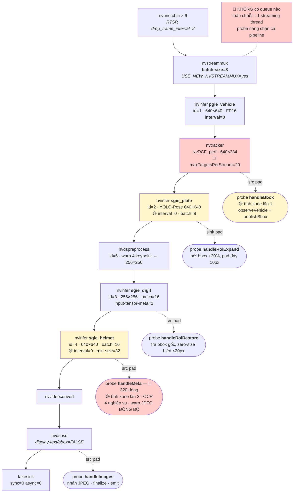

### 1B. SAU

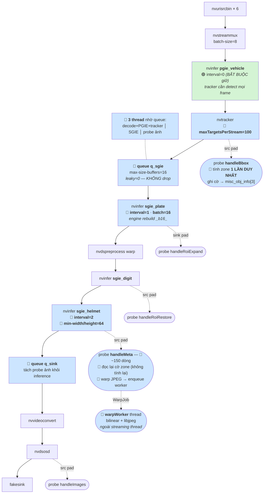

> **Vì sao PGIE phải giữ `interval=0`**: tracker cần detection mọi frame để `anchor_history_`
> liên tục. Bỏ frame → đoạn `prev→anchor` đứt → WRONG_WAY bỏ sót lần cắt vạch
> (`plate_probe.cpp:916-918` đã ghi nhận).
>
> **Vì sao queue không được `leaky`**: mỗi buffer drop = 1 OCR reading mất + 1 đoạn đứt
> trong `anchor_history_`. Chỉ nhánh MQTT mới nên leaky.

---

## Sơ đồ 2 — Vòng đời nghiệp vụ (đề xuất B, quan trọng nhất)

### 2A. TRƯỚC — một cổng chặn duy nhất cho 4 nghiệp vụ

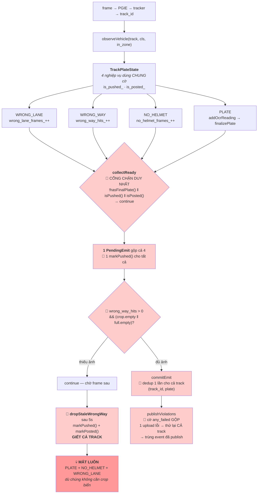

**Log production xác nhận nhánh đỏ đang chạy thật:**
```
track 130: WRONG_WAY quá 5.0s không đủ ảnh (crop biển + full-frame) — bỏ track
track 323: WRONG_WAY quá 5.0s không đủ ảnh (crop biển + full-frame) — bỏ track
```

### 2B. SAU — mỗi nghiệp vụ một vòng đời

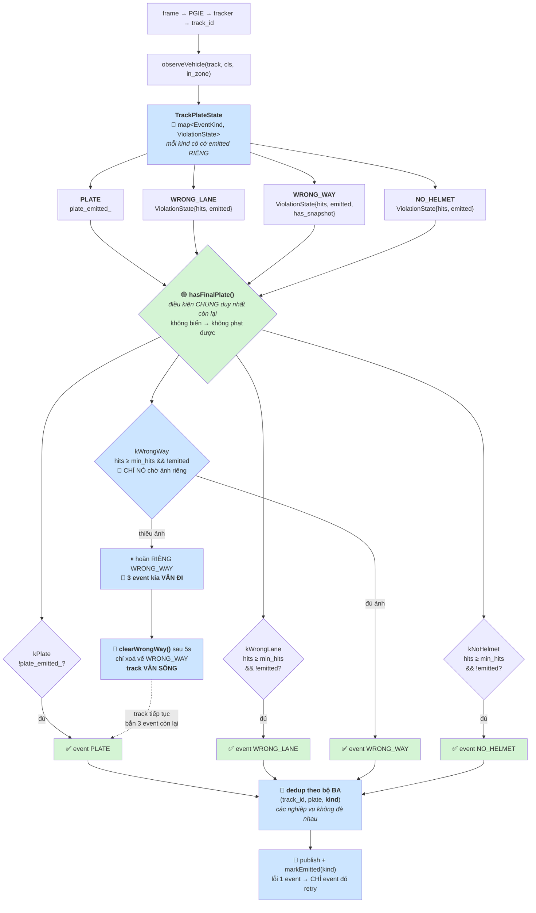

> **Làm rõ**: tách nghiệp vụ **không** có nghĩa vi phạm bắn được khi chưa có biển —
> `hasFinalPlate()` vẫn là điều kiện chung (không biển thì không xử phạt được). Cái được
> tách là: **ảnh** (WW thiếu ảnh chỉ hoãn WW), **cờ đã bắn**, **dedup**, và **timeout**.

---

## Sơ đồ 3 — Chốt biển số (đề xuất C)

### 3A. TRƯỚC — hình học xe quyết định khi nào dừng đọc

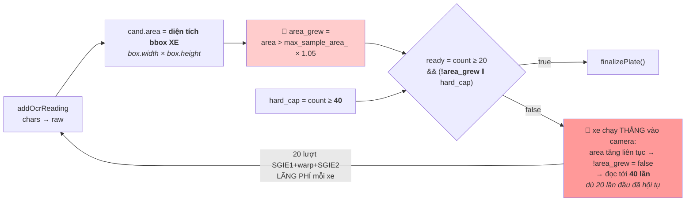

**Vì sao sai**: `area` là hình học **xe**, nhưng đang quyết định khi nào dừng đọc **biển**.
Hai đại lượng không có quan hệ nhân quả — xe tiến gần không đảm bảo biển rõ hơn (xe có thể
đang rẽ, biển nghiêng đi, hoặc bị che).

### 3B. SAU — độ hội tụ của chính chuỗi biển quyết định

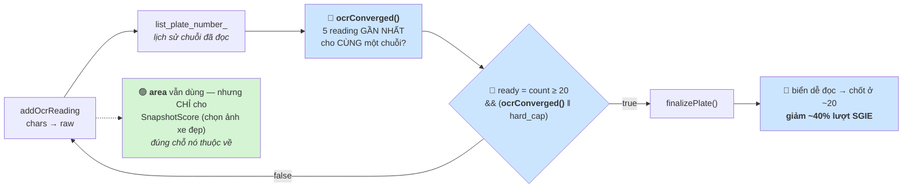

> 5 reading liên tiếp giống nhau là bằng chứng hội tụ **mạnh hơn** "xe chưa tiến gần".
> `area` không biến mất — nó chuyển về đúng vai trò: chọn ảnh phương tiện đẹp nhất.

---

## Sơ đồ 4 — Chọn ảnh crop biển (đề xuất D)

### 4A. TRƯỚC — conf của FRAME, không phải của chuỗi THẮNG

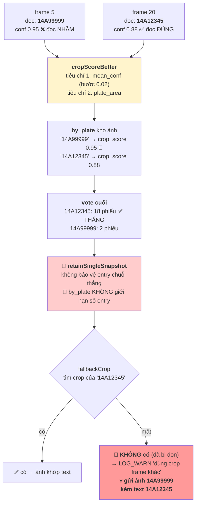

### 4B. SAU — số phiếu là tiêu chí đầu tiên

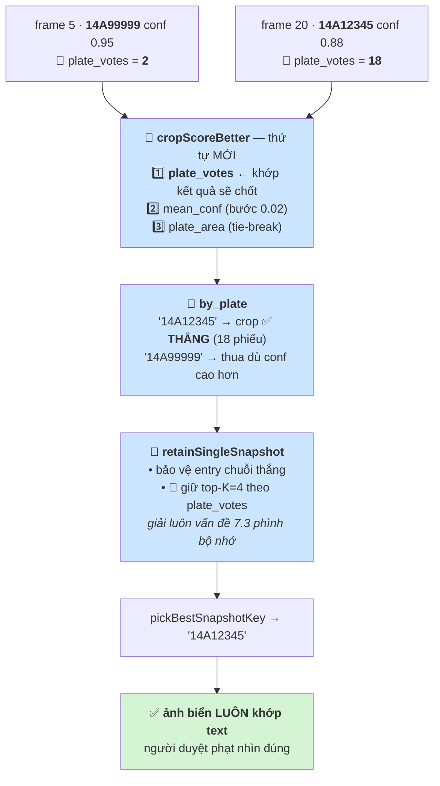

> **Lưu ý về D**: `plate_area` trong `cropScoreBetter` **không phải** chỗ sai — nó chỉ là
> tie-break khi conf chênh < 0.02, vô hại. Chỗ cần sửa là thêm `plate_votes` làm tiêu chí
> **đầu tiên**, để crop bám theo chuỗi sẽ thắng vote chứ không theo conf của frame lẻ.

---

## Sơ đồ 5 — NO_HELMET (đề xuất E)

### 5A. Đề xuất gốc — vì sao KHÔNG khả thi

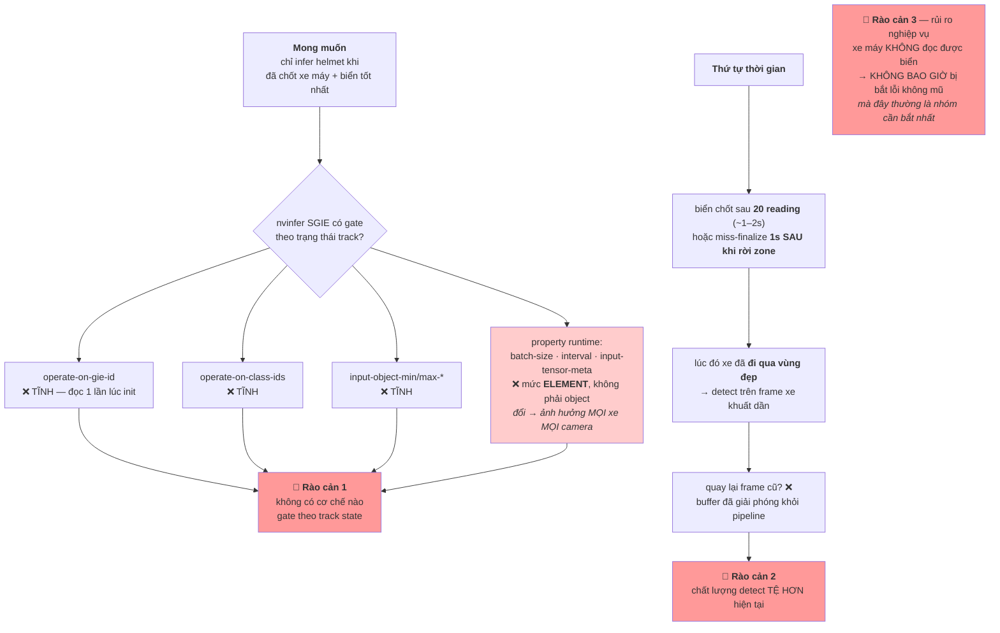

### 5B. Phương án thay thế — đạt cùng mục tiêu

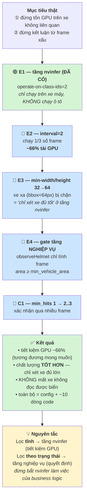

---

## Sơ đồ 6 — Tổng hợp: luồng dữ liệu E2E sau khi sửa

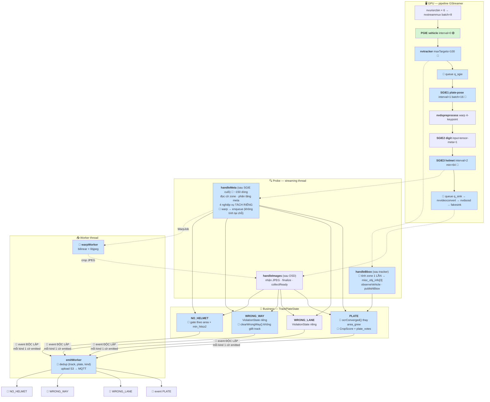

---

## Bảng đối chiếu TRƯỚC / SAU

| Khía cạnh | TRƯỚC | SAU |
|---|---|---|
| **Thread** | 1 streaming thread cho toàn chuỗi | 3 thread (queue) + 2 worker |
| **Tính zone** | 🔴 2 lần/frame, 2 nguồn sự thật | 🔵 1 lần, ghi `misc_obj_info[3]` |
| **Cổng chốt event** | 🔴 1 cổng chung cho 4 nghiệp vụ | 🔵 mỗi nghiệp vụ 1 cờ `emitted` |
| **WW thiếu ảnh** | 🔴 giết cả track → mất 3 event kia | 🔵 chỉ hoãn WW, 3 event kia vẫn đi |
| **Dedup** | 🔴 `(track, plate)` | 🔵 `(track, plate, kind)` |
| **Chốt OCR** | 🔴 theo `area` bbox xe → tới 40 reading | 🔵 theo `ocrConverged()` → ~20 |
| **Chọn crop** | 🔴 conf của frame lẻ | 🔵 `plate_votes` (chuỗi thắng vote) |
| **`by_plate`** | 🔴 không giới hạn | 🔵 top-K=4 theo votes |
| **Warp JPEG** | 🔴 đồng bộ trong probe (chặn GPU queue) | 🔵 worker thread |
| **SGIE1** | interval=0, batch=8 | interval=1, batch=16 |
| **SGIE3 helmet** | interval=0, min-size=32 | interval=2, min-size=64 |
| **maxTargetsPerStream** | 🔴 20 (mất track) | 🔵 100 |
| **`handleMeta`** | 🔴 320 dòng, 6 việc | 🔵 ~150 dòng, tách hàm |
| **GPU util (6 cam)** | 83% | ước ~50–55% |

---

# PHẦN IV — Nhật ký triển khai

Ghi lại **trạng thái code thực tế sau mỗi commit**, khác với Phần III vốn vẽ đích cuối.
Mỗi mục có sơ đồ phản ánh đúng những gì đã chạy được tại thời điểm đó.

Nhánh: `feat/tach-vong-doi-4-nghiep-vu`. Mỗi commit build debug + chạy
`vehicle_business_tests` + chạy `tests/data/test.mp4` trước khi sang commit kế tiếp.

---

## Commit 0 — khôi phục `vehicle_business_tests`

`tests/business_cpp/test_business.cpp` không tồn tại nhưng `CMakeLists.txt:190` vẫn tham
chiếu, với `BUILD_TESTS` mặc định ON → `Dockerfile:22` phải build với `-DBUILD_TESTS=OFF`.

Tạo lại: 47 case thuần business, không cần GPU, chạy <1s. **45 pass, 2 FAIL có chủ đích** —
hai case đó là bằng chứng chạy được của bug dedup (xem Commit 2).

---

## Commit 1 — `EventKind` + `ViolationState`

Nền tảng cho vòng đời per-kind. Thay 14 trường rời trong `TrackPlateState` bằng 2 mảng:

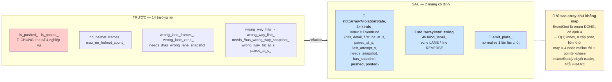

Mọi accessor cũ giữ làm inline forwarder → `plate_probe.cpp` và `plate_recognizer.cpp` chưa
phải sửa dòng nào. **Hành vi không đổi**, xác nhận bằng test (70/72, vẫn đúng 2 FAIL cũ).

---

## Commit 2 — `DedupCache` khoá theo bộ ba + TTL

Bug nghiêm trọng hơn bản phân tích sơ bộ mô tả: cache **không** khoá theo `(track_id, plate)`
mà là **hai deque khớp OR**.

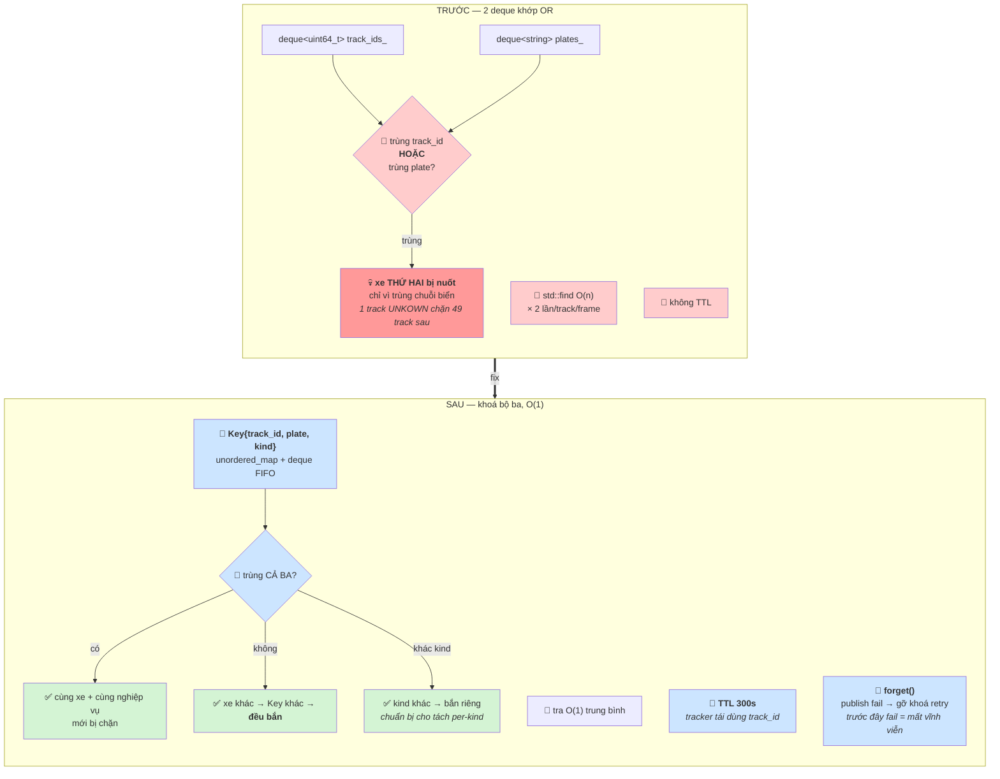

**Kết quả**: 2 case FAIL cố ý từ Commit 0 chuyển xanh. Đây là bug mất dữ liệu độc lập với
B1, và là bug **đầu tiên được sửa dứt điểm** trong loạt này.

---

## Commit 3 — `clearStaleWrongWay`: bỏ vế, không giết track

Nửa sau của B1. `dropStaleWrongWay` cũ gọi `markPushed()+markPosted()` → `shouldForceDelete`
xoá track → mất luôn PLATE/NO_HELMET/WRONG_LANE.

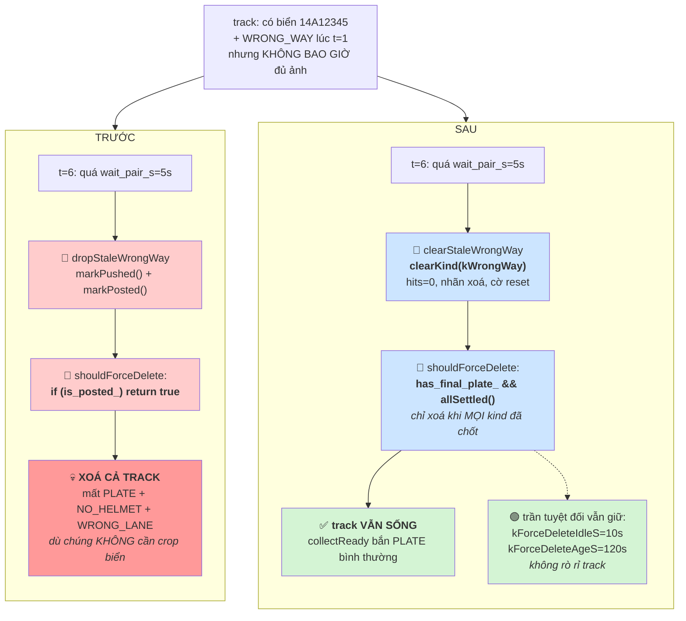

Log đổi từ `"— bỏ track"` sang `"— bỏ RIÊNG vế ngược chiều"`.

Test tái hiện đúng kịch bản production (xe cắt vạch, có biển, không đủ ảnh) và xác nhận
`collectReady` vẫn trả event PLATE sau khi vế WRONG_WAY bị bỏ. **93/93 case pass.**

> Lưu ý: đây mới là **nửa sau** của B1. Nửa đầu — `plate_probe.cpp` còn `continue` chặn cả
> track khi thiếu ảnh — được sửa ở commit B1 dứt điểm sau khi `collectReady` tách theo kind.

---

## Commit 4+5 — `ReadyEmit` per-kind và **B1 dứt điểm**

Nửa đầu của B1. `PendingEmit` gộp 17 field của cả 4 nghiệp vụ, và `collectReady` có 5 cổng
`continue` dùng chung cờ `is_pushed_`/`is_posted_`. Hệ quả: thiếu ảnh WRONG_WAY thì
`continue` bỏ qua **toàn bộ** phần dựng `EmitJob`, mất luôn 3 event kia.

```mermaid
flowchart TD
    CR["collectReady(now_s, &ready_buf_)"]

    subgraph GATE["🔵 readyMaskLocked — phân loại 5 cổng cũ"]
        direction TB
        C0{"🟢 <b>hasFinalPlate()</b><br/>cổng CHUNG duy nhất còn lại<br/><i>không biển → không xử phạt được</i>"}
        C1{"🟢 <b>shouldEmitPlate</b><br/>CHUNG — biển xấu thì mọi kind chịu<br/>🔵 markAllPosted() có chủ đích"}
        C2["🔵 <b>PER-KIND</b>: pushed ‖ posted"]
        C3["🔵 <b>PER-KIND</b>: settle — CHỈ kWrongWay"]
        C4["🔵 <b>PER-KIND</b>: retry throttle<br/><i>ks.last_attempt_s thay map phụ</i>"]
        C5["🔵 <b>PER-KIND</b>: dedup (track, plate, <b>kind</b>)<br/>trùng → markPosted(k) RIÊNG kind đó"]
        C0 --> C1 --> C2 --> C3 --> C4 --> C5
    end

    CR --> GATE
    MASK["🔵 <b>ready_mask</b> (bitmask 4 bit)"]
    GATE --> MASK

    Z{"🔵 ready_mask == 0?"}
    MASK --> Z
    SKIP["🔵 <b>bỏ qua, KHÔNG copy string</b><br/><i>trước đây mọi track chờ ảnh vẫn copy<br/>4 std::string MỖI FRAME</i>"]
    Z -->|"có"| SKIP

    RE["🔵 <b>ReadyEmit</b> — 1 phần tử/track<br/>ready_mask + payload[4] + labels[4]<br/><i>1 track = 1 lần tra kho ảnh = 1 EmitJob<br/>→ số job KHÔNG tăng, kMaxEmitQueue an toàn</i>"]
    Z -->|"không"| RE

    IMG{"🔵 kWrongWay ∈ want<br/>&& (crop ‖ full rỗng)?"}
    RE --> IMG

    DROPBIT["🔵 <b>want &= ~kindBit(kWrongWay)</b><br/>chỉ GỠ BIT ngược chiều<br/>💚 <b>3 nghiệp vụ kia VẪN BẮN</b>"]
    IMG -->|"thiếu ảnh"| DROPBIT
    IMG -->|"đủ ảnh"| COMMIT

    DROPBIT --> W{"want == 0?"}
    W -->|"có"| WAIT["chờ frame sau"]
    W -->|"không"| COMMIT

    COMMIT["🔵 <b>commitEmit(track, plate, want)</b><br/>dedup + markPushed theo TỪNG kind"]
    JOB["🔵 EmitJob{want}<br/>chỉ điền số liệu của kind đang bắn<br/>🔵 <b>KHÔNG snapshots.erase()</b><br/><i>kind chưa bắn còn cần kho ảnh</i>"]
    SET["🔵 <b>settleKinds(track, want, done)</b><br/>done → markPosted(k)<br/>lỗi tạm → unmarkPushed(k) + dedup.forget(k)"]

    COMMIT --> JOB --> SET

    style C0 fill:#d4f4d4
    style C1 fill:#d4f4d4
    style C2 fill:#cce5ff
    style C3 fill:#cce5ff
    style C4 fill:#cce5ff
    style C5 fill:#cce5ff
    style MASK fill:#cce5ff
    style SKIP fill:#cce5ff
    style RE fill:#cce5ff
    style IMG fill:#cce5ff
    style DROPBIT fill:#d4f4d4
    style COMMIT fill:#cce5ff
    style JOB fill:#cce5ff
    style SET fill:#cce5ff
```

**Ba thay đổi quan trọng ngoài B1:**

1. **Bỏ `snapshots.erase(track_id)`** (`plate_probe.cpp:1373` cũ). Với mô hình per-kind, mỗi
   kind có thể emit ở frame khác nhau, nên xoá kho ảnh ngay sau job đầu tiên sẽ giết ảnh của
   kind chưa bắn. `pruneOrphanSnapshots` (1s/lần) dọn theo `hasTrack`, mà track chỉ bị xoá
   khi `allSettled()` — kho ảnh sống đúng bằng vòng đời track.

2. **Xoá `last_attempt_s_`** — map thứ hai song song `tracks_`, phải erase thủ công ở
   `cleanup`. Nay `ViolationState::last_attempt_s` cho retry throttle **riêng từng nghiệp
   vụ**, đúng ngữ nghĩa hơn và bớt một cây.

3. **Giảm copy string**: lọc `ready_mask == 0` **trước** khi chạm string. Trước đây mọi track
   đã chốt biển và chưa posted đều copy 4 `std::string` mỗi frame suốt thời gian chờ ảnh
   (có thể vài chục frame). Cộng với `emitPlate()` cache và buffer `ready_buf_` tái dùng →
   gần như không cấp phát trong vòng emit.

**Test**: 107/107 pass. Ba case chứng minh trực tiếp mô hình mới — chốt riêng WRONG_LANE thì
PLATE/NO_HELMET vẫn sẵn sàng; publish fail thì `settleKinds` gỡ khoá dedup để retry được.

---

## Commit 6 — retry per-kind ở tầng publisher

`canPublishXxx` trả `bool` gộp **hai ý nghĩa khác hẳn nhau**, và `publishViolations` gom
chúng vào một cờ `any_failed` cho cả track. Đây là gốc của bug bắn trùng event.

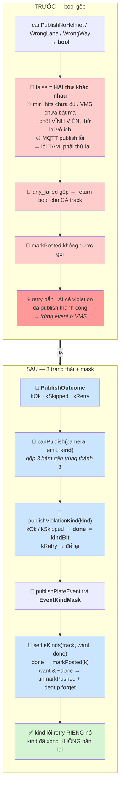

Sửa kèm: cổng upload chung đổi `return false` → `return 0`; bổ sung `canPublish(kWrongWay)`
vào phép kiểm `has_violation` (trước đây thiếu, nên track chỉ vi phạm ngược chiều bắn thừa
một event phương tiện).

---

## Commit 7 — `zones` không bị xoá bởi payload chỉ có `lines`

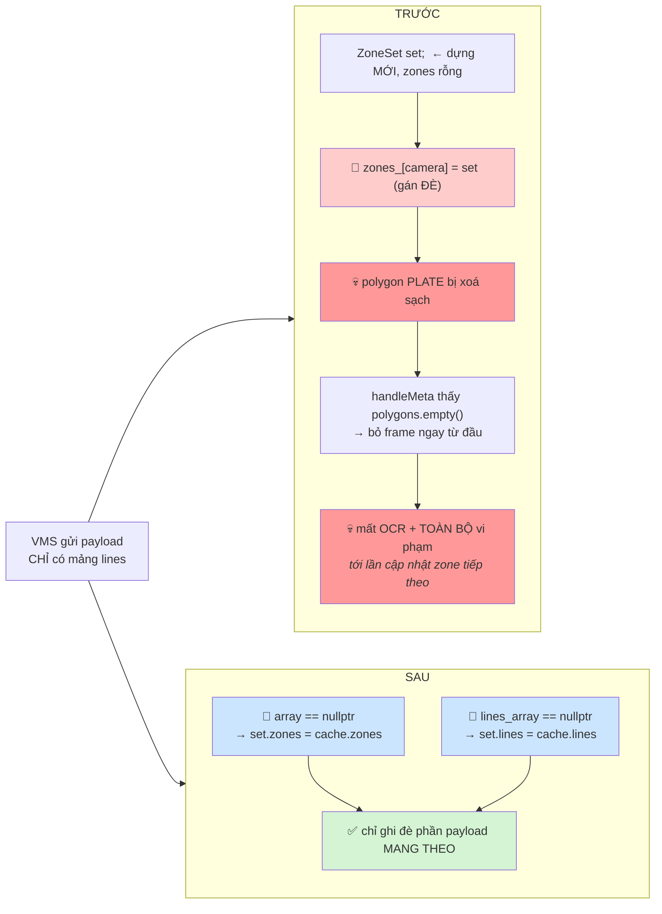

Đối xứng: payload chỉ có `zones` sẽ xoá line REVERSE_DIRECTION → WRONG_WAY ngừng chạy im lặng.

---

## Commit 9 — `direction` không bị scale méo góc

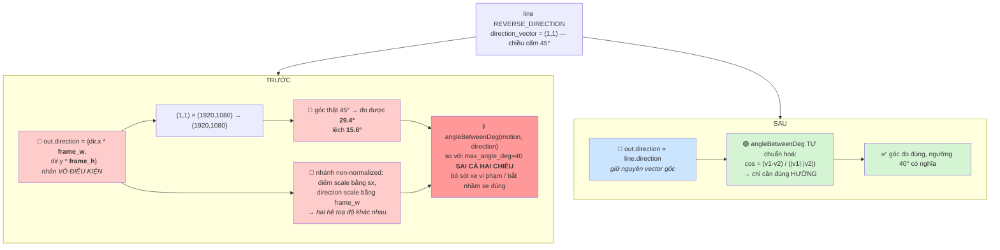

> Comment cũ nói "chỉ cần đúng dấu" — điều đó chỉ đúng nếu dùng **tích vô hướng**. Code dùng
> **góc**, nên độ lớn tương đối giữa x và y có ý nghĩa. Test có case chứng minh trực tiếp.

---

## Commit 8 — dọn dẹp

Giảm ròng **37 dòng** sau khi cấu trúc per-kind đã ổn định:

| Việc | Trước | Sau |
|---|---|---|
| Forwarder tạm | `markPushed()/markPosted()/isPushed()/isPosted()` không tham số | xoá; `awaitingSnapshot` dùng `pendingKinds() != 0` |
| Snapshot API | 4 hàm `needs/markWrongLane…` + `needs/markWrongWay…` | 2 hàm nhận `EventKind` |
| Chụp ảnh bằng chứng | 2 khối gần trùng trong `handleMeta` | 1 helper `submitViolationSnapshot` |
| Cổng publish | 3 hàm `canPublishNoHelmet/WrongLane/WrongWay` | 1 `canPublish(camera, emit, kind)` |
| Mã chết | 6 ký hiệu không caller | xoá |

Sáu ký hiệu chết: `PlateProbe::hasWrongWayLine`, `utils::directionDot`,
`TrackPlateState::shouldRetryMissPush`, `PlateRecognizer::hasSnapshotSamples`,
`anchorHistory()`, `last_sample_area_`. Hai cái đầu là dấu vết của lần refactor WRONG_WAY
trước — viết ra rồi thay bằng cách khác nhưng không xoá.

---

## Tổng kết Giai đoạn 1+2 (9 commit)

| # | Commit | Bug được đóng |
|---|---|---|
| 0 | khôi phục unit test | — (lưới an toàn; 2 case FAIL cố ý làm bằng chứng bug dedup) |
| 1 | EventKind + ViolationState | — (nền tảng, hành vi không đổi) |
| 2 | DedupCache bộ ba + TTL | **Xe thứ hai bị nuốt khi trùng chuỗi biển** |
| 3 | clearStaleWrongWay | **B1 nửa sau**: quá hạn WW giết cả track |
| 4+5 | ReadyEmit per-kind | **B1 nửa đầu**: thiếu ảnh WW chặn 3 event kia |
| 6 | retry per-kind | **Bắn trùng event đã publish thành công** |
| 7 | vms_client zones | **Payload lines-only xoá polygon → mất OCR** |
| 9 | direction không scale | **WRONG_WAY so góc sai cả hai chiều** |
| 8 | dọn dẹp | — (−37 dòng) |

Test: **113/113 pass**. Mỗi commit đều build debug + chạy `tests/data/test.mp4` trước khi
sang commit kế tiếp.
